# HOUSING SOCIETY MANAGEMENT

## About

This is the implementation of a Housing Society Management. It uses Laravel as a backend API service integrated with Reactjs for the front end, and NodeJs for the chat using socket.

## Features

- Login and register the user with validation.
- Pages of Home, About Us and Services.
- Contact Us page with email confirmation
- Registration with email confirmation.
- 4 types of users: Resident, Visitor, Admin, and Manager
- Resident can book services, approve visitor requests, upload images and chat     with management.
- Visitors can request to visit a resident, visit a garden, report an incident with email confirmation and chat with management.
- Admin can perform crud operations on managers, buildings, services, residents, visitors, and amenities.
- Managers can perform crud operations on buildings, services, residents, visitors, and amenities as well as chat with residents/visitors.
- Logout functionality implemented.
- Gallery page to show resident image uploads.
- Dynamic chat between management, resident, and visitors.

## Instructions

- Install npm, composer
- Run composer install.
- Generate key with `PHP artisan key:generate`
- Run npm install in both the folders (lunamar_laravel_with_react and lunamar-chat-server)
- Run `npm run dev` to create necessary files for reactjs in laraval.
- Configure MYSQL database details in the .env file
- Run `php artisan serve` in the lunamar_laravel_with_react folder
- Run `npm start` in the lunamar-chat-server folder.

## Website Demo Screenshots

- Home Page

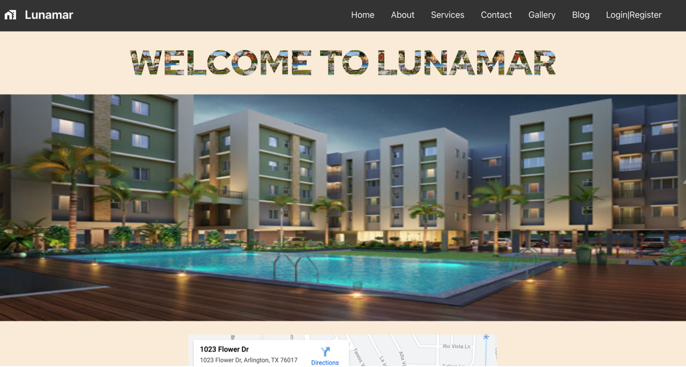

- About Us

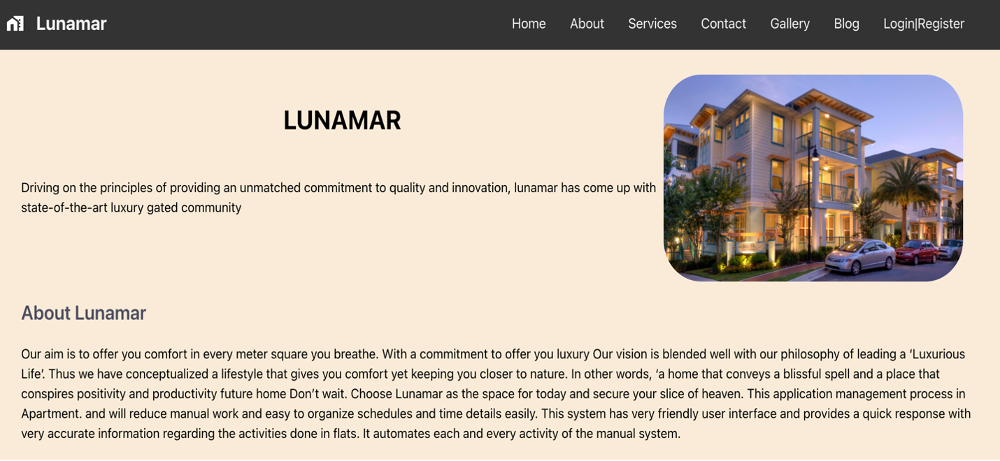

- Services Page

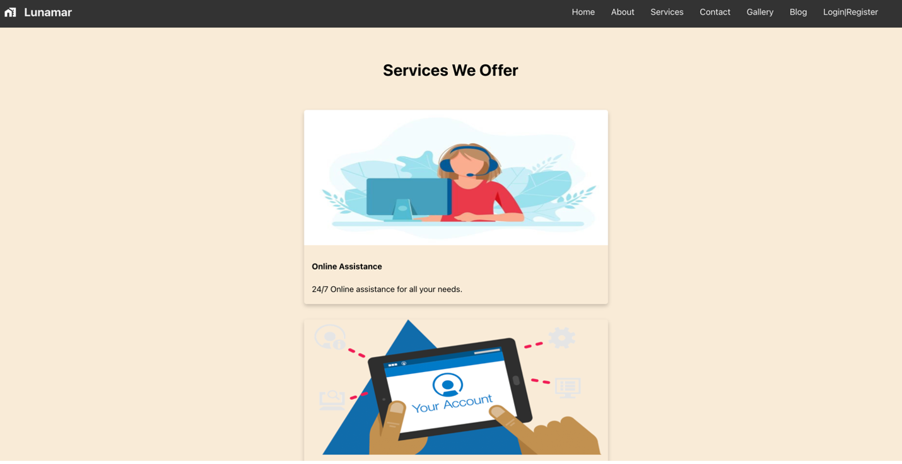

- Contact Us

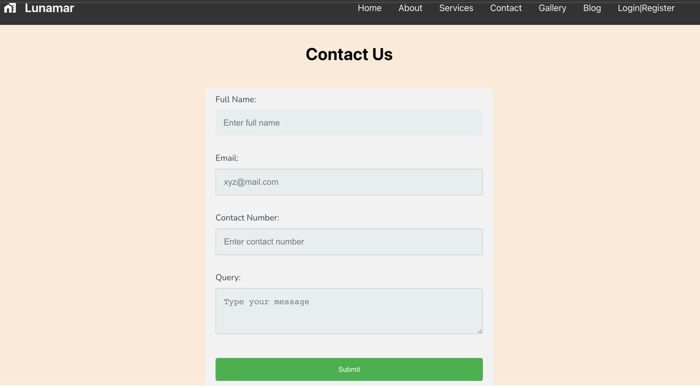

- Residents Upload Gallery

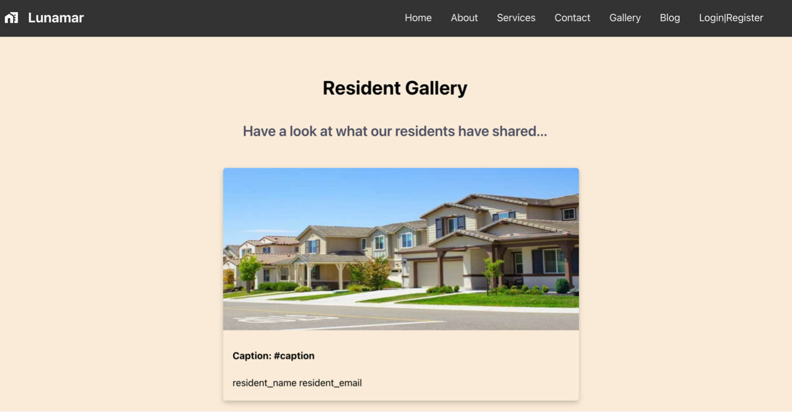

- Blog Page

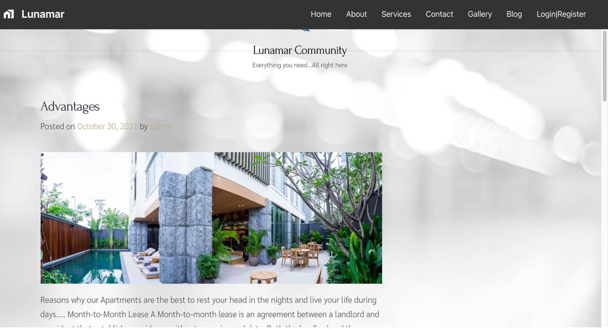

- Login and Sign-up

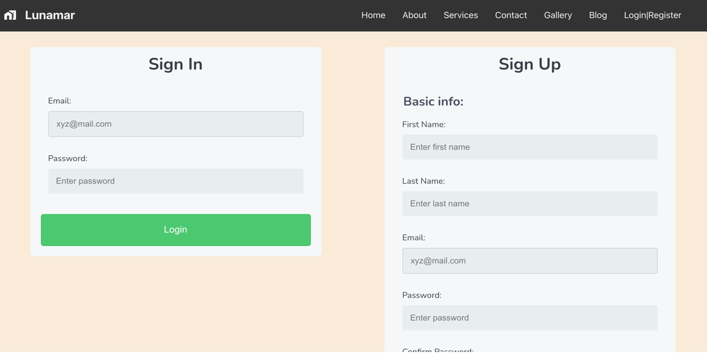

- Resident Page

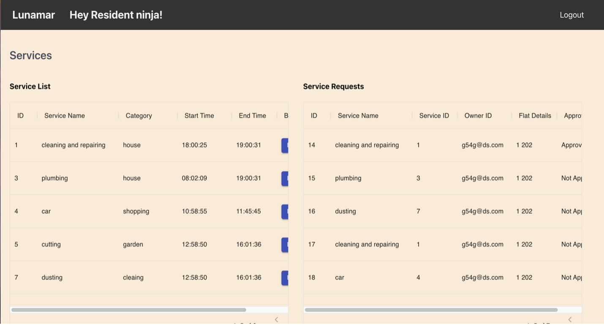

- Visitor Page

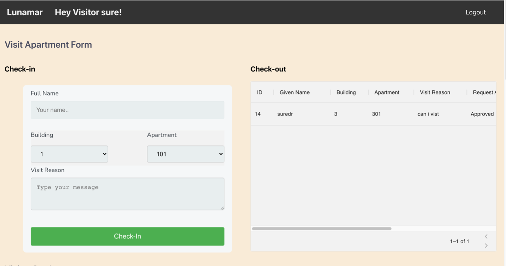

- Admin Page

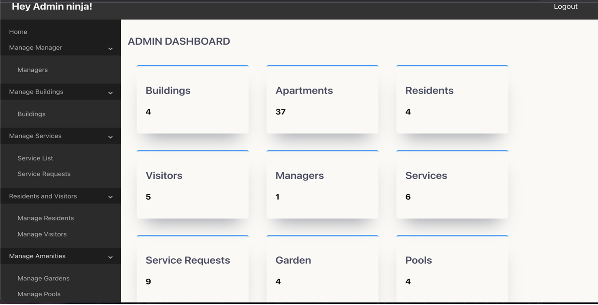

- Manager Page

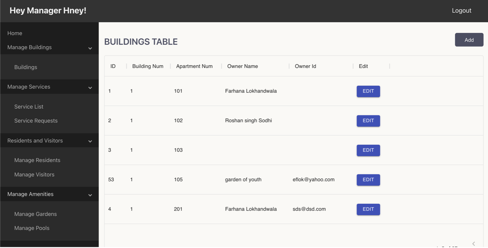

- Chat between User and Manager

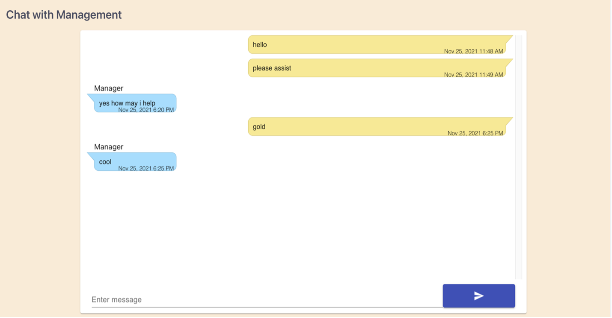

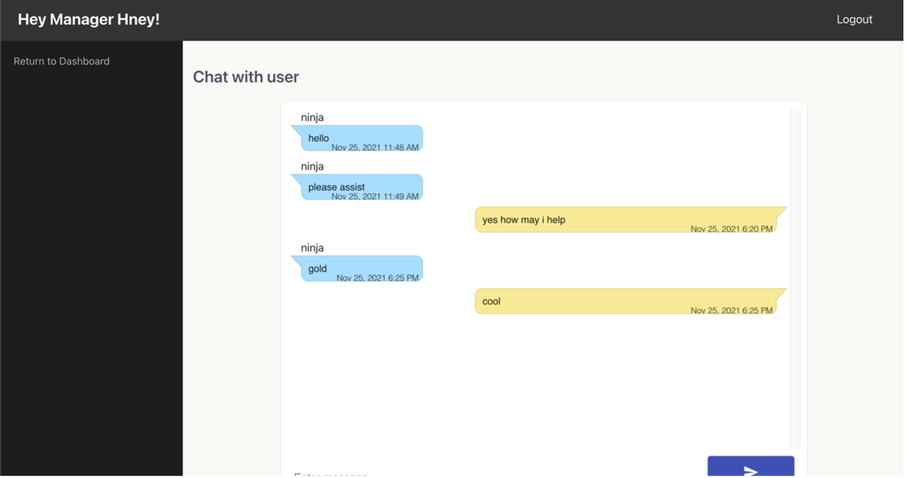
